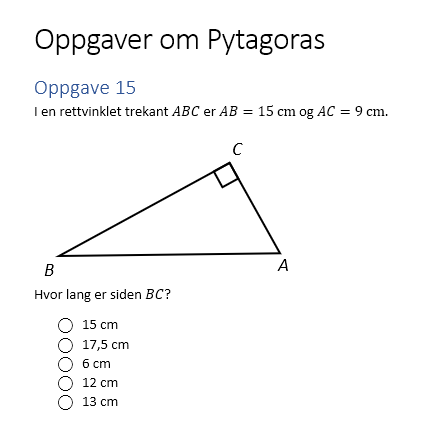

## Eksempel A - Oppgave i matematikk


Skjermdump av oppgaven:


#### Kall som leverandører i AVT-prosjektet **SKAL** levere respons på

Hent statements for en enkelt elev
```
GET ~/statements?agent={"account":{"name":"76a7a061-3c55-430d-8ee0-6f82ec42501f","homePage":"https://docs.dataporten.no"}}
```

Hent statements for en enkelt elev som ligger innenefor et kompetansemål
```
GET ~/statements?agent={"account":{"name":"76a7a061-3c55-430d-8ee0-6f82ec42501f","homePage": "https://docs.dataporten.no"}}&activity=http://psi.udir.no/kl06/KM240&related_activities=true
```

#### Kall som leverandører i AVT-prosjektet **KAN** levere respons på

Hent statements for en enkelt elev som ligger innenefor et kompetansemål **OG** har et bestemt kompetansenivå
```
GET ~/statements?agent={"account":{"name":"76a7a061-3c55-430d-8ee0-6f82ec42501f","homePage": "https://docs.dataporten.no"}}&activity=http://psi.udir.no/kl06/KM240&activity=https://fagkart.no/avt/pisa/mathematical-competence-class/competence-class-2&related_activities=true
```

Hent statements for en enkelt elev som ligger innenfor et område i fagkartet
```
GET ~/statements?agent={"account":{"name":"76a7a061-3c55-430d-8ee0-6f82ec42501f","homePage":"https://docs.dataporten.no"}}&activity=https://fagkart.no/avt/area-within-the-map/OFK100001&related_activities=true
```

#### Eksempler på respons
Responsen skal da inneholde alle statements som er merket mot de overnevnte søkekriteriene. I tillegg skal responsen også levere på overliggende statements til disse, som eventuelt ligger i leverandørens LRS (logget på oppgavesett, kapittel for oppgaven, overliggende oppgave om dette er en deloppgave osv.)


##### Respons for et statement som beskriver at eleven har svart feil på eksempelet over. 
Dette er en **minimumsrespons** på hva leverandører i AVT bør levere. Her har leverandøren valgt å ikke vise innholdet av oppgaven. Det bør da legges inn en lenke (bak pålogging) til oppgaven eller til en side som forklarer innholdet. Denne legges under "object.definition.moreInfo".
```json
{
    "id": "f9c2806a-88dc-4f79-886f-0f76f9839556",
    "timestamp": "2020-04-10T11:31:02Z",
    "actor": {
        "objectType": "Agent",
        "account": {
            "homePage": "https://docs.dataporten.no",
            "name": "76a7a061-3c55-430d-8ee0-6f82ec42501f"
        }
    },
    "verb": {
        "id": "http://adlnet.gov/expapi/verbs/answered",
        "display": {
            "en-US": "answered",
            "nb-NO": "besvarte"
        }
    },
    "object": {
        "objectType": "Activity",
        "id": "https://oppgaver.flottmatte.no/task/123456",
        "definition": {
            "name": {
                "nb-NO": "Oppgaver om Pytagoras: Oppgave 15"
            },
            "moreInfo": "https://oppgaver.flottmatte.no/task/123456/this-can-be-a-human-readable-webpage-explaining-the-task"
        }
    },
    "result": {
        "duration": "PT15S",
        "success": false,
        "score": {
            "min": 0.0,
            "max": 2.0,
            "raw": 0.0,
            "scaled": 0.0
        }
    },
    "context": {
        "platform": "Flott matte - En flott portal for matematikkoppgaver",
        "language": "nb-NO",
        "contextActivities": {
            "grouping": [
                {
                    "objectType": "Activity",
                    "id": "http://psi.udir.no/kl06/KM240"
                },
                {
                    "objectType": "Activity",
                    "id": "https://clientadmin.dataporten-api.no/clients/xxxxxxxx-xxxx-xxxx-xxxx-xxxxxxxxxxxx"
                }
            ]
        }
    }
}
```

##### Er elevens svar helt eller delvis korrekt, vil "result"-delen kunne bli følgende 
```json
    "result": {
        "duration": "PT15S",
        "success": true,
        "score": {
            "min": 0.0,
            "max": 2.0,
            "raw": 2.0,
            "scaled": 1.0
        }
    },
```

##### Ønsker leverandøren å vise oppgaveteksten i responsen, kan "object"-delen se slik ut
```json
    "object": {
        "objectType": "Activity",
        "id": "https://oppgaver.flottmatte.no/task/123456",
        "definition": {
            "name": {
                "nb-NO": "Oppgaver om Pytagoras: Oppgave 15"
            },
            "description": {
                "nb-NO": "I en rettvinklet trekant ABC er AB = 15 cm og AV = 9 cm.\nHvor lang er siden BC?"
            },
            "type": "http://adlnet.gov/expapi/activities/cmi.interaction",
            "interactionType": "choice",
            "choices": [
                {
                    "id": "A",
                    "description": {
                        "nb-NO": "15 cm"
                    }
                },
                {
                    "id": "B",
                    "description": {
                        "nb-NO": "17,5 cm"
                    }
                },
                {
                    "id": "C",
                    "description": {
                        "nb-NO": "6 cm"
                    }
                },
                {
                    "id": "D",
                    "description": {
                        "nb-NO": "12 cm"
                    }
                },
                {
                    "id": "E",
                    "description": {
                        "nb-NO": "13 cm"
                    }
                }
            ],
            "correctResponsesPattern": [
                "D"
            ]
        }
    },
```

Da **skal** "result" også vise elevens valg av alternativ ("response")
```json
    "result": {
        "duration": "PT15S",
        "response": "D",
        "success": true,
        "score": {
            "min": 0.0,
            "max": 2.0,
            "raw": 2.0,
            "scaled": 1.0
        }
    },
```

##### "context" kan utvides. 
Det **kan** i tillegg til kompetansemål legges inn kobling mot lk20 sine begrep 'verb', 'grunnleggende ferdigheter' og 'kjerneelementer', og koblinger mot fagkart eller vanskegrad. Det **bør** her legges inn alle koblinger som leverandøren har merket sine oppgaver mot. 
I eksempelt er "definition" tatt med under "contextActivities.grouping". Denne er frivillig  å ta med i responsen. "objectType" og "id" **må** imidlertid alltid være med.
I tillegg **bør** responsen også inneholde referanse til overliggende statements (logget på oppgavesett, kapittel for oppgaven, overliggende oppgave om dette er en deloppgave osv.), om disse finnes.
```json
    "context": {
        "registration": "67541c94-7783-4108-a087-605a6299127b",
        "platform": "Flott matte - En flott portal for matematikkoppgaver",
        "language": "nb-NO",
        "contextActivities": {
            "parent" : [
                {
                    "id" : "https://oppgaver.flottmatte.no/page/123"
                }
            ],
            "grouping": [
                {
                    "objectType": "Activity",
                    "id": "http://psi.udir.no/kl06/KM240",
                    "definition": {
                        "name": {
                            "nb-NO": "utforske, beskrive og argumentere for samanhengar mellom sidelengdene i trekantar"
                        },
                        "type": "https://w3id.org/xapi/avt/activity-types/competence-objective"
                    }
                },
                {
                    "objectType": "Activity",
                    "id": "http://psi.udir.no/kl06/VERB19",
                    "definition": {
                        "name": {
                            "nb-NO": "Beskrive"
                        },
                        "description": {
                            "nb-NO": "Å beskrive er å skildre eller gjengi en opplevelse, situasjon, arbeidsprosess eller et faglig emne. Å beskrive noe kan også være å bruke relevante fagbegreper for å systematisere kunnskap om emnet."
                        },
                        "type": "https://w3id.org/xapi/avt/activity-types/competence-verb"
                    }
                },
                {
                    "objectType": "Activity",
                    "id": "http://psi.udir.no/kl06/GF1",
                    "definition": {
                        "name": {
                            "nb-NO": "Muntlige ferdigheter"
                        },
                        "type": "https://w3id.org/xapi/avt/activity-types/competence-basic-skills"
                    }
                },
                {
                    "objectType": "Activity",
                    "id": "http://psi.udir.no/kl06/KE12",
                    "definition": {
                        "name": {
                            "nn-NO": "Utforsking og problemløysing"
                        },
                        "description": {
                            "nn-NO": "Utforsking i matematikk handlar om at elevane leiter etter mønster, finn samanhengar og diskuterer seg fram til ei felles forståing. Elevane skal leggje meir vekt på strategiane og framgangsmåtane enn på løysingane. Problemløysing i matematikk handlar om at elevane utviklar ein metode for å løyse eit problem dei ikkje kjenner frå før. Algoritmisk tenking er viktig i prosessen med å utvikle strategiar og framgangsmåtar for å løyse problem og inneber å bryte ned eit problem i delproblem som kan løysast systematisk. Vidare inneber det å vurdere om delproblema best kan løysast med eller utan digitale verktøy. Problemløysing handlar òg om å analysere og forme om kjende og ukjende problem, løyse dei og vurdere om løysingane er gyldige."
                        },
                        "type": "https://w3id.org/xapi/avt/activity-types/competence-core-elements"
                    }
                },
                {
                    "objectType": "Activity",
                    "id": "https://fagkart.no/avt/area-within-the-map/OFK11227",
                    "definition": {
                        "name": {
                            "nb-NO": "Pytagoras setning"
                        },
                        "type": "https://w3id.org/xapi/avt/activity-types/area-within-the-map"
                    }
                },
                {
                    "objectType": "Activity",
                    "id": "https://fagkart.no/avt/pisa/mathematical-competence-class/competence-class-2",
                    "definition": {
                        "name": {
                            "nb-NO": "Se forbindelser og kunne integrere informasjon som grunnlag for problemløsing"
                        },
                        "description": {
                            "nb-NO": "innebærer at elevene er i stand til å se sammenhenger mellom ulike områder av matematikken og bruke ulike representasjoner av samme fenomen, samt se sammenhenger mellom definisjoner, beviser, eksempler og påstander"
                        },
                        "type": "https://w3id.org/xapi/avt/activity-types/mathematical-competence-class"
                    }
                },
                {
                    "objectType": "Activity",
                    "id": "https://clientadmin.dataporten-api.no/clients/xxxxxxxx-xxxx-xxxx-xxxx-xxxxxxxxxxxx",
                    "definition": {
                        "name": {
                            "nb-NO": "Flott undervisning"
                        },
                        "description": {
                            "nb-NO": "En flott portal for nettoppgaver"
                        },
                        "type": "https://w3id.org/xapi/avt/activity-types/feide-clientinfo"
                    }
                }
            ]
        }
    }
}
```

